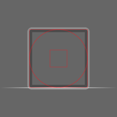

# Geometry Dash Icon Templates

GD has a lot of weird quirks when it comes to icon creation, so this project is meant to catagorize everything into project/template files for various programs.

## Useful Resources

| Link                                                                                | Description                                                                                                                                    |
| ----------------------------------------------------------------------------------- | ---------------------------------------------------------------------------------------------------------------------------------------------- |
| [Icon Creator](https://iconcreator.pages.dev/)                                      | Web based icon creator with support for icon plist compiling, previewing, showcasing, and tools like auto glow and secondary layer generation. |
| [GDBrowser Icon Kit](https://gdbrowser.com/iconkit/)                                | Online Icon Kit for the game. Useful for quick referencing, and also contains a dev tool section for previewing different offsets of layers.   |
| [GD Colon Spritesheet Splitter (& Merger)](https://gdcolon.com/gdsplitter/)         | Online gamesheet splitter and merger. Can be useful for compiling icons and splitting already existing gamesheets.                             |
| [Bulk Export To Medium Quality Tool](https://github.com/Luar77/LIT/releases/latest) | Does what it says on the tin. Just place the EXE in a folder you want to bulk downscale and watch the magic.                                   |
| [Icon Gallery Submit](https://gallerysubmit.pages.dev/)                             | The page used to generate and submit `.gdicon` files to the Icon Gallery. **Be sure to read over the guidelines before submitting.**           |

## Template Files Setup

### Adobe Photoshop

Extract the `.PSDT` files to any directory you would like. `PSDT` files are the same as `PSD` files, but when you open a `PSDT` file it will create a new project from the file. It helps prevent accidental saves on top of the template file.

Photoshop doesn't have a special place to store template files because they want you to use their Adobe Stock product. You will have to either open them in the `Open` interface or just open the file directly in the explorer.

### Adobe Illustrator

#### AIT Files

Extract the template files into `C:\Program Files\Adobe\Adobe Illustrator {version}\Cool Extras\{region_code}\Templates`

You can use these quickly by doing any of the following:

- Clicking `File > New from Template...`
- Clicking `Shift + Ctrl + N`
- Clicking `More Settings` then `Templates` in the new file interface
  - This is a lot easier if you go to your settings and enable `Use legacy "File New" interface`. This will instead bring you straight to the more settings instead of the newer file new window.

#### Swatches

You will want to extract the `gd_color_swatches.ai` file to the following directory:

`C:\Users\{username}\AppData\Roaming\Adobe\Adobe Illustrator 30 Settings\{region_code}\x64\Swatches`

Once done you can open it inside of any project by clicking the color icon in the corner, then `Library (book icon) > User Defined > gd_color_swatches`

### Paint.NET

#### PDN Files

Extract the project files to any directory you would like.

Each icon has a `.PDN` file with all of the template info. Make sure to select the `content` layer when designing so that you don't end up messing up the guides (Paint.NET does not have layer locking).

#### Palette File

Extract the `gd_colors.txt` file into the following directory:

`Documents\Paint.NET User Files\Palettes`

Once done you can click the palette icon inside the color window and select the `gd_colors` palette.

### ibisPaint

Extract the project files to any directory you would like.

Each icon has a `.IPV` file with all of the template info.

### Raw SVG

Each layer has been split into it's own file in order to group things together better. SVG doesn't support layers the same as something like Illustrator or Flash does. These were mostly made to just make it easier to port the vector files over to different programs to later be exported as project files.

## Icon Info

The following info should all be listed inside the info layer on each template, but here's a quick reference guide for all of the icons.

### Naming Conventions

Some game modes have names that don't match what they're called in game. This is mainly due to Robtop calling them something else originally and not changing them later on (GD has an ungodly amount of technical debt). Here's a quick list of all of them for reference:

- Cube -> `player`
- Ball -> `player_ball`
  - The only icon that has a `player_` prefix
- UFO -> `bird`
  - The gamemode was originally based off of Flappy Bird, so it's assumed Bird is a reference to that as a code name
- Wave -> `dart`
  - Dart was the original name for the wave before the community essentially renamed it. It was actually named dart in previous game updates before being renamed later on

The rest of the icons are self explainitory (ex: Ship -> `ship`).

### Stroke Sizes

> **Glow Stroke is 4px for every icon**

| Icon Type          | Outer Stroke | Inner Stroke |
| ------------------ | ------------ | ------------ |
| cube (player)      | 6px          | ≤4px         |
| ship               | 4px          | ≤4px         |
| ball (player_ball) | 6px          | ≤4px         |
| ufo (bird)         | 4px          | ≤3px         |
| dart (dart)        | 5px          | ≤4px         |
| robot              | 4-5px        | ≤4px         |
| spider             | 4-5px        | ≤4px         |
| swing              | 4-5px        | ≤4px         |
| jetpack            | 5px          | ≤4px         |

### Unique Gamemode Information

**UFO (bird)**

- Dome Opacity: 25%
- Dome Stroke: 3px
- Dome Texture Name: `bird_##_3_001`

**Wave (dart)**

- Uses sharp corners on the outer stroke instead of rounded corners like the rest of the icons in game.

**Robot**

- Head Rotation: 2°
- Head Texture Name: `robot_##_01_001`
  - Secondary layer `robot_##_01_2_001`
  - Extra layer `robot_##_01_extra_001`
- Front Connector: 315°
- Back Connector: 300°
- Connector Texture Name: `robot_##_02_001`
  - Secondary layer `robot_##_02_2_001`
  - **No extra layer support**
- Front Leg: 43°
- Back Leg: 30°
- Leg Texture Name: `robot_##_03_001`
  - Secondary layer `robot_##_03_2_001`
  - **No extra layer support**

**Spider**

- Head Texture Name: `spider_##_01_001`
  - Secondary layer: `spider_##_01_2_001`
  - Extra layer: `spider_##_01_extra_001`
- Back Leg Rotation: 322°
- Back Leg Texture Name: `spider_##_03_001`
  - Secondary layer: `spider_##_01_2_001`
  - **No extra layer support**
- Connector Rotation: 8°
- Connector Texture Name: `spider_##_01_4_001`
  - Secondary layer: `spider_##_04_2_001`
  - **No extra layer support**
- Background Legs Scale: 0.9x

## Contributing

Contributions are welcome! The most wanted contribution would be to port the project files over to programs that are not included currently.
